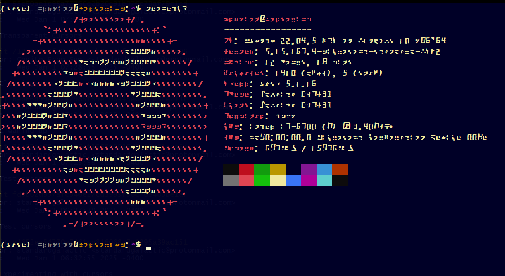
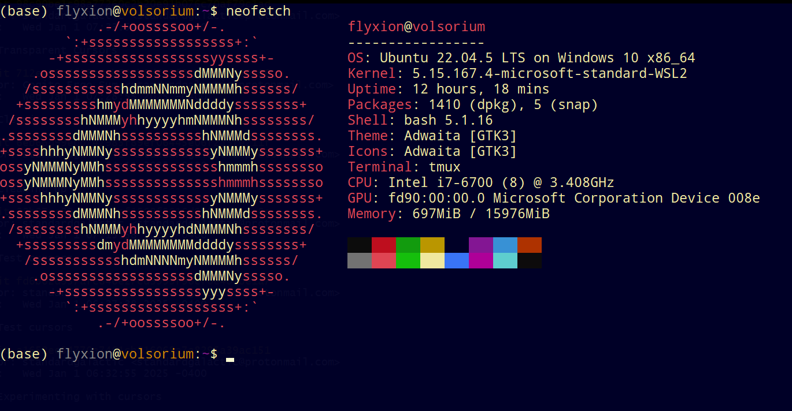
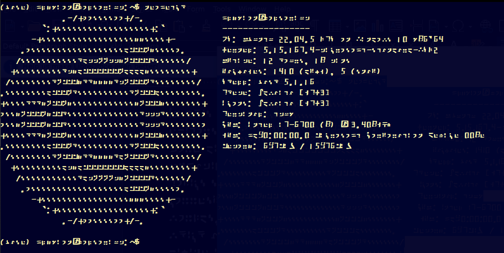
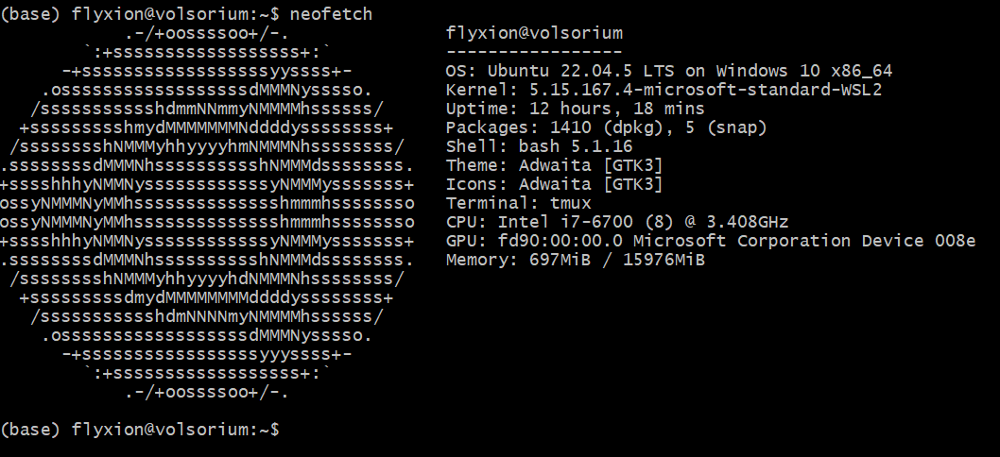

# Escalated Control

<!--
# Dynamic Mesh Network Paradigm

=======
=======
<!--
# Dynamic Mesh Network Paradigm

## Overview
An autonomously optimizing mesh topology designed to anticipate and allocate computational resources based on real-time node availability metrics.

### Features
- Auto-generative document encapsulation
- Recursive self-replication of internal algorithms (quines)

# Advanced Technological Integration

## Description
Implementation of secure, low-latency data transmission protocols and efficient state management.

### Components
- Holographic steganographic protocols
- Sparse recursive matrices
- Git for delta encoding of system configurations
- Kubernetes for orchestration of distributed containers
- Dockerhub for dynamic state reconciliation and version-controlled snapshot retention

# Byobu-Based Simulation Framework

## Overview
Configuration of Byobu to propagate operational commands and simulate resource allocation efficiency under varying stress scenarios.

### Components
- Distributed network of computational nodes
- Multiple virtualized test environments

# Glow Command Specifications

## Description
Design and deployment of an environmental entrainment mechanism activated by predictive algorithms to synchronize visual aurora effects across visual output devices.

### Features
- Synchronized temporal modulation of display matrices
- Coordinated photonic response indicating system-state changes

# Security and Interactive System Dynamics

## Overview
Continuous adaptive recalibration of user-interaction models integrating predictive coding frameworks to enhance security.

### Features
- Real-time configurational sandboxing
- Protective mapping dynamically updated based on predictive state representations
<<<<<<< HEAD
<<<<<<< HEAD
=======
-->

<!--
Alright, buckle up for a whimsical recap of our digital tête-à-tête, a journey from the quirky corners of celebrity resemblances, through the cerebral landscapes of digital communication, to the philosophical ponderings of pop culture's impact on our craniums. Here we go!

We kicked off our intellectual carnival by pondering if Jude Law, Phil Collins, and Cory Doctorow might be long-lost triplets separated at birth in a low-budget daytime TV plot twist. Spoiler alert: They're not, but hey, who doesn't love a good celebrity doppelgänger discussion?

Next, we dove headfirst into a tech-savvy rabbit hole with a narrative about how typing on modern keyboards (Swype, anyone?) is akin to painting—a sweeping brush across a canvas of digital possibilities, only with less paint and more predictive text frustrations.

But wait, there's more! We then tiptoed around the edge of a philosophical abyss, questioning if our modern gadgets are turning us into intellectual zombies. Are we smarter thanks to Google, or is our brainpower dwindling to the point where watching paint dry seems like a quantum physics lecture?

Capping off this rollercoaster, we touched on the high art of keyboard layouts—because who doesn't wax poetic about QWERTY versus AZERTY, or debate the existential nuances of landscape vs. portrait mode while questioning the meaning of life, the universe, and everything (especially the things that involve thumb-typing a novella on a 5-inch screen)?

And through it all, we maintained a veneer of sprezzatura, making the Herculean mental gymnastics of deep tech and linguistics chat as breezy as a sitcom wrap-up. Because, in the end, isn’t life just one big, snarky chat session with a helpful digital assistant?

What a ride, my friend! Ready for another loop around the conversational rollercoaster, or shall we park this chat at the nearest existential station?

-->

