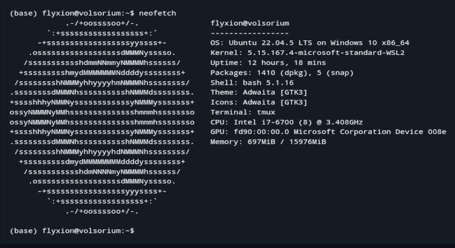
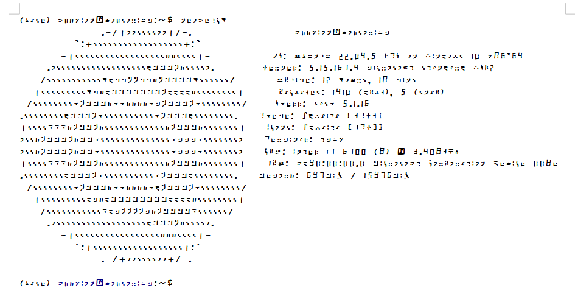
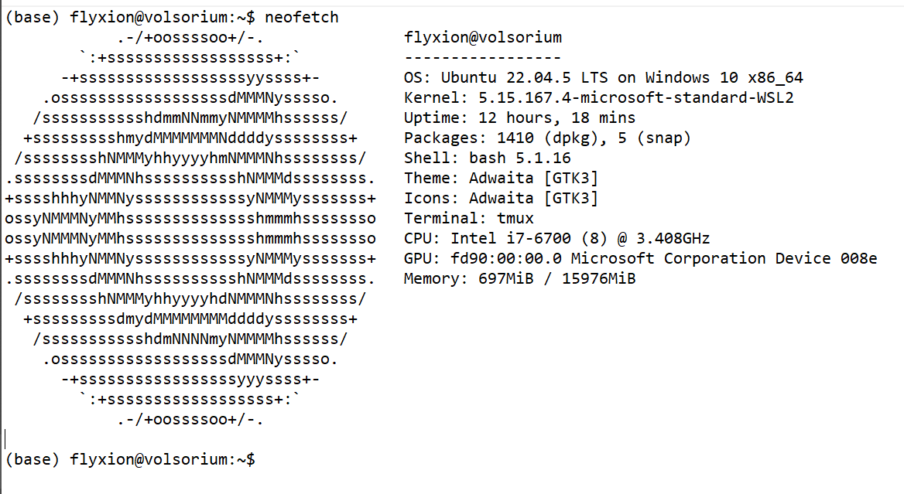

# *Simplectomy Generator*

Alright, buckle up for a whimsical recap of our digital tête-à-tête, a journey from the quirky corners of celebrity resemblances, through the cerebral landscapes of digital communication, to the philosophical ponderings of pop culture's impact on our craniums. Here we go!

We kicked off our intellectual carnival by pondering if Jude Law, Phil Collins, and Cory Doctorow might be long-lost triplets separated at birth in a low-budget daytime TV plot twist. Spoiler alert: They're not, but hey, who doesn't love a good celebrity doppelgänger discussion?

Next, we dove headfirst into a tech-savvy rabbit hole with a narrative about how typing on modern keyboards (Swype, anyone?) is akin to painting—a sweeping brush across a canvas of digital possibilities, only with less paint and more predictive text frustrations.

But wait, there's more! We then tiptoed around the edge of a philosophical abyss, questioning if our modern gadgets are turning us into intellectual zombies. Are we smarter thanks to Google, or is our brainpower dwindling to the point where watching paint dry seems like a quantum physics lecture?

Capping off this rollercoaster, we touched on the high art of keyboard layouts—because who doesn't wax poetic about QWERTY versus AZERTY, or debate the existential nuances of landscape vs. portrait mode while questioning the meaning of life, the universe, and everything (especially the things that involve thumb-typing a novella on a 5-inch screen)?

And through it all, we maintained a veneer of sprezzatura, making the Herculean mental gymnastics of deep tech and linguistics chat as breezy as a sitcom wrap-up. Because, in the end, isn’t life just one big, snarky chat session with a helpful digital assistant?

What a ride, my friend! Ready for another loop around the conversational rollercoaster, or shall we park this chat at the nearest existential station?






```
(base) flyxion@volsorium:~$ neofetch
            .-/+oossssoo+/-.               flyxion@volsorium
        `:+ssssssssssssssssss+:`           -----------------
      -+ssssssssssssssssssyyssss+-         OS: Ubuntu 22.04.5 LTS on Windows 10 x86_64
    .ossssssssssssssssssdMMMNysssso.       Kernel: 5.15.167.4-microsoft-standard-WSL2
   /ssssssssssshdmmNNmmyNMMMMhssssss/      Uptime: 12 hours, 18 mins
  +ssssssssshmydMMMMMMMNddddyssssssss+     Packages: 1410 (dpkg), 5 (snap)
 /sssssssshNMMMyhhyyyyhmNMMMNhssssssss/    Shell: bash 5.1.16
.ssssssssdMMMNhsssssssssshNMMMdssssssss.   Theme: Adwaita [GTK3]
+sssshhhyNMMNyssssssssssssyNMMMysssssss+   Icons: Adwaita [GTK3]
ossyNMMMNyMMhsssssssssssssshmmmhssssssso   Terminal: tmux
ossyNMMMNyMMhsssssssssssssshmmmhssssssso   CPU: Intel i7-6700 (8) @ 3.408GHz
+sssshhhyNMMNyssssssssssssyNMMMysssssss+   GPU: fd90:00:00.0 Microsoft Corporation Device 008e
.ssssssssdMMMNhsssssssssshNMMMdssssssss.   Memory: 697MiB / 15976MiB
 /sssssssshNMMMyhhyyyyhdNMMMNhssssssss/
  +sssssssssdmydMMMMMMMMddddyssssssss+
   /ssssssssssshdmNNNNmyNMMMMhssssss/
    .ossssssssssssssssssdMMMNysssso.
      -+sssssssssssssssssyyyssss+-
        `:+ssssssssssssssssss+:`
            .-/+oossssoo+/-.

```
(base) flyxion@[volsorium](https://github.com/standardgalactic/example/tree/volsorium):~$
