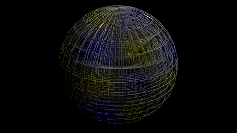
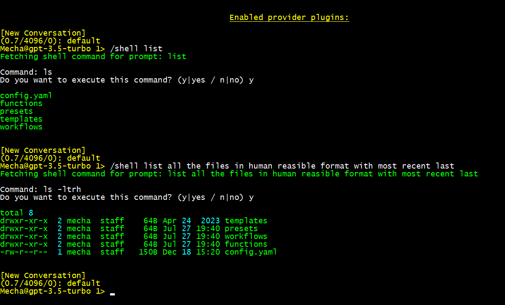

# Escalated Control

<!--
# Dynamic Mesh Network Paradigm

=======
# Dynamic Mesh Network Paradigm

>>>>>>> ce4d7ab (Dynamic Mesh Network)
## Overview
An autonomously optimizing mesh topology designed to anticipate and allocate computational resources based on real-time node availability metrics.

### Features
- Auto-generative document encapsulation
- Recursive self-replication of internal algorithms (quines)

# Advanced Technological Integration

## Description
Implementation of secure, low-latency data transmission protocols and efficient state management.

### Components
- Holographic steganographic protocols
- Sparse recursive matrices
- Git for delta encoding of system configurations
- Kubernetes for orchestration of distributed containers
- Dockerhub for dynamic state reconciliation and version-controlled snapshot retention

# Byobu-Based Simulation Framework

## Overview
Configuration of Byobu to propagate operational commands and simulate resource allocation efficiency under varying stress scenarios.

### Components
- Distributed network of computational nodes
- Multiple virtualized test environments

# Glow Command Specifications

## Description
Design and deployment of an environmental entrainment mechanism activated by predictive algorithms to synchronize visual aurora effects across visual output devices.

### Features
- Synchronized temporal modulation of display matrices
- Coordinated photonic response indicating system-state changes

# Security and Interactive System Dynamics

## Overview
Continuous adaptive recalibration of user-interaction models integrating predictive coding frameworks to enhance security.

### Features
- Real-time configurational sandboxing
- Protective mapping dynamically updated based on predictive state representations
<<<<<<< HEAD
-->

